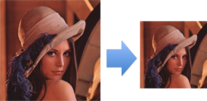

[事前準備] JavaでOpenCVを使う
********************************************************************************

画像処理を行うために、超有名なライブラリである\ `OpenCV <http://opencv.org/>`_\ を使用します。JavaからOpenCVを扱うために、今回は\ `JavaCV <https://github.com/bytedeco/javacv>`_\ というライブラリを使います。

JavaCVは\ `JavaCPP <https://github.com/bytedeco/javacpp>`_\ というC++のソースから自動生成してできるブリッジのようなもので作られています。MavenやGradleなどの依存性解決の仕組みで簡単に利用できて、手軽にセットアップできるので今回採用しました。

本章では、手元の環境でJavaCVを利用できるかどうかを確認します。(\ **本章の内容はSpring Bootとは一切関係がありません**\ )

まずは先ほどのkusokoraディレクトリの1つ上の階層に移動してください。

.. code-block:: console

    $ cd ..

そして、サンプルプロジェクトをcloneします。

.. code-block:: console

    $ git clone https://github.com/making/hello-cv.git
    $ cd hello-cv

チェックアウトしたプロジェクトのpom.xmlの後半の部分を見てください。

.. code-block:: xml

    <profiles>
        <profile>
            <id>macosx-x86_64</id>
            <activation>
                <os>
                    <family>mac</family>
                    <arch>x86_64</arch>
                </os>
            </activation>
            <properties>
                <classifier>macosx-x86_64</classifier>
            </properties>
        </profile>
        <profile>
            <id>linux-x86_64</id>
            <activation>
                <os>
                    <family>unix</family>
                    <arch>amd64</arch>
                </os>
            </activation>
            <properties>
                <classifier>linux-x86_64</classifier>
            </properties>
        </profile>
        <profile>
            <id>windows-x86_64</id>
            <activation>
                <os>
                    <family>windows</family>
                    <arch>amd64</arch>
                </os>
            </activation>
            <properties>
                <classifier>windows-x86_64</classifier>
            </properties>
        </profile>
        <profile>
            <id>windows-x86</id>
            <activation>
                <os>
                    <family>windows</family>
                    <arch>x86</arch>
                </os>
            </activation>
            <properties>
                <classifier>windows-x86</classifier>
            </properties>
        </profile>
    </profiles>

実行環境により、どのプロファイル(アーキテクチャ)を使用するかを判断しています。このプロファイルで定義されている\ ``<classifier>``\ プロパティが、

.. code-block:: xml

    <dependency>
        <groupId>org.bytedeco.javacpp-presets</groupId>
        <artifactId>opencv</artifactId>
        <version>${opencv.version}</version>
        <classifier>${classifier}</classifier>
    </dependency>

に使われ、環境にあったネイティブライブラリをダウンロードします。

では早速サンプルアプリを実行してみましょう。

.. code-block:: console

    $ mvn compile exec:java -Dexec.mainClass=com.example.App

次のようなログが、出力され、

.. code-block:: console

    path = /Users/maki/tmp/hello-cv/target/classes/lena.png
    image = IplImage[width=512,height=512,depth=8,nChannels=3]

下図のように、src/main/resources/lena.pngのサイズが半分になったhalf-lena.png(右側)が出来あがります。

\ **このプログラムが問題なく実行で切れいれば、OpenCVの動作検証はOKです**\ 。以下は読み飛ばしても構いません。

.. note::

    以下のようなエラーが出ていたら、ネイティブライブラリが正しく設定されていません。

    .. code-block:: console

        java.lang.reflect.InvocationTargetException
            at sun.reflect.NativeMethodAccessorImpl.invoke0(Native Method)
            at sun.reflect.NativeMethodAccessorImpl.invoke(NativeMethodAccessorImpl.java:62)
            at sun.reflect.DelegatingMethodAccessorImpl.invoke(DelegatingMethodAccessorImpl.java:43)
            at java.lang.reflect.Method.invoke(Method.java:483)
            at org.codehaus.mojo.exec.ExecJavaMojo$1.run(ExecJavaMojo.java:293)
            at java.lang.Thread.run(Thread.java:745)
        Caused by: java.lang.UnsatisfiedLinkError: no jniopencv_core in java.library.path
            at java.lang.ClassLoader.loadLibrary(ClassLoader.java:1857)
            at java.lang.Runtime.loadLibrary0(Runtime.java:870)
            at java.lang.System.loadLibrary(System.java:1119)
            at org.bytedeco.javacpp.Loader.loadLibrary(Loader.java:535)
            at org.bytedeco.javacpp.Loader.load(Loader.java:410)
            at org.bytedeco.javacpp.Loader.load(Loader.java:353)
            at org.bytedeco.javacpp.opencv_core.<clinit>(opencv_core.java:10)
            at java.lang.Class.forName0(Native Method)
            at java.lang.Class.forName(Class.java:340)
            at org.bytedeco.javacpp.Loader.load(Loader.java:385)
            at org.bytedeco.javacpp.Loader.load(Loader.java:353)
            at org.bytedeco.javacpp.opencv_highgui.<clinit>(opencv_highgui.java:13)
            at com.example.App.resize(App.java:18)
            at com.example.App.main(App.java:14)
            ... 6 more
        Caused by: java.lang.UnsatisfiedLinkError: no opencv_core in java.library.path
            at java.lang.ClassLoader.loadLibrary(ClassLoader.java:1857)
            at java.lang.Runtime.loadLibrary0(Runtime.java:870)
            at java.lang.System.loadLibrary(System.java:1119)
            at org.bytedeco.javacpp.Loader.loadLibrary(Loader.java:535)
            at org.bytedeco.javacpp.Loader.load(Loader.java:401)
            ... 15 more

    うまくいかない場合は、自分の環境に合わせて、次のように明示的にプロファイルを指定してみてください。

    .. code-block:: console

        $ mvn compile exec:java -Dexec.mainClass=com.example.App -P<classifier>

    \ ``<classifier>``\ には以下のいずれかの値が入ります。

    * windows-x86_64
    * linux-x86_64
    * macosx-x86_64
    * windows-x86
    * linux-x86

少しだけソースコードを確認しましょう。

.. code-block:: java

    package com.example;

    import java.net.URISyntaxException;
    import java.nio.file.Paths;

    import static org.bytedeco.javacpp.opencv_core.*;
    import static org.bytedeco.javacpp.opencv_highgui.*;
    import static org.bytedeco.javacpp.opencv_imgproc.*;

    public class App {
        public static void main(String[] args) throws URISyntaxException {
            // 引数で与えられたパスかクラスパス上のlena.pngを使用する。
            String filepath = args.length > 0 ? args[0] : Paths.get(
                    App.class.getResource("/lena.png").toURI()).toString();
            resize(filepath);
        }

        public static void resize(String filepath) {
            // 画像を読み込んで、IplImageインスタンスを作成する
            IplImage source = cvLoadImage(filepath, CV_LOAD_IMAGE_ANYDEPTH | CV_LOAD_IMAGE_ANYCOLOR);
            System.out.println("path = " + filepath);
            System.out.println("image = " + source);
            if (source != null) {
                // 変換後の画像を作成する。幅と高さが元画像の半分になるようにする
                IplImage dest = cvCreateImage(cvSize(source.width() / 2, source.height() / 2), source.depth(), source.nChannels());
                // リサイズする
                cvResize(source, dest, CV_INTER_NN);
                // 画像を保存する
                cvSaveImage("half-" + Paths.get(filepath).getFileName().toString(), dest);
                cvReleaseImage(source);
                cvReleaseImage(dest);
            }
        }
    }

引数をとって任意の画像をリサイズする場合は、以下のように実行してください。

.. code-block:: console

   $ mvn compile exec:java -Dexec.mainClass=com.example.App -Dexec.args=hoge.png

ここでは古いOpenCVのAPIを使用しました。

次に新しいOpenCV 2系のC++ APIに対応したJava APIを使用します。また、OpenCVでおなじみの顔認識を行います。

.. note::

    Open CV 2系のAPIリファレンスは\ `このサイト <http://book.mynavi.jp/support/pc/opencv2/c3/index.html>`_\ がわかりやすいです。ほとんどのコードがJavaCVでも利用できるので、遊んでみてください。

サンプルコードのブランチをdukerに切り替えます。

.. code-block:: console

    $ git checkout duker

再度、サンプルアプリを実行しましょう。

.. code-block:: console

   $ mvn compile exec:java -Dexec.mainClass=com.example.App

次のようなログが、出力され、

.. code-block:: console

    load /Users/maki/tmp/hello-cv/target/classes/lena.png
    1 faces are detected!

下図のように、src/main/resources/lena.pngの顔の部分がDukeのように変換されたduked-faces.png(右側)が出来あがります。

プログラムを見てみましょう。

.. code-block:: java

    package com.example;

    import static org.bytedeco.javacpp.opencv_core.*;
    import static org.bytedeco.javacpp.opencv_objdetect.*;

    import java.awt.image.BufferedImage;
    import java.io.File;
    import java.io.IOException;
    import java.io.OutputStream;
    import java.net.URISyntaxException;
    import java.nio.file.Files;
    import java.nio.file.Paths;

    import javax.imageio.ImageIO;

    public class App {
        public static void main(String[] args) throws URISyntaxException, IOException {
            String filepath = args.length > 0 ? args[0] : Paths.get(
                    App.class.getResource("/lena.png").toURI()).toString();
            faceDetect(filepath);
        }

        public static void faceDetect(String filepath) throws URISyntaxException, IOException {
            // 分類器の読み込み
            String classifierName = Paths.get(
                    App.class.getResource("/haarcascade_frontalface_default.xml")
                            .toURI()).toString();
            CascadeClassifier faceDetector = new CascadeClassifier(classifierName);
            System.out.println("load " + filepath);
            // 新しいAPIでは画像データを格納するデータ構造としてMatクラスを使用する。
            // ここではJavaの世界とやりとりしやすいようにjava.awt.image.BufferedImageを経由する。
            Mat source = Mat.createFrom(ImageIO.read(new File(filepath)));
            // 顔認識結果
            Rect faceDetections = new Rect();
            // 顔認識実行
            faceDetector.detectMultiScale(source, faceDetections);
            // 認識した顔の数
            int numOfFaces = faceDetections.limit();
            System.out.println(numOfFaces + " faces are detected!");
            for (int i = 0; i < numOfFaces; i++) {
                // i番目の認識結果
                Rect r = faceDetections.position(i);
                int x = r.x(), y = r.y(), h = r.height(), w = r.width();
                // Dukeのように描画する
                // 上半分の黒四角
                rectangle(source, new Point(x, y), new Point(x + w, y + h / 2),
                        new Scalar(0, 0, 0, 0), -1, CV_AA, 0);
                // 下半分の白四角
                rectangle(source, new Point(x, y + h / 2), new Point(x + w, y + h),
                        new Scalar(255, 255, 255, 0), -1, CV_AA, 0);
                // 中央の赤丸
                circle(source, new Point(x + h / 2, y + h / 2), (w + h) / 12,
                        new Scalar(0, 0, 255, 0), -1, CV_AA, 0);
            }

            // 描画結果をjava.awt.image.BufferedImageで取得する。
            BufferedImage image = source.getBufferedImage();
            try (OutputStream out = Files.newOutputStream(Paths
                    .get("duked-faces.png"))) {
                // 画像を出力する
                ImageIO.write(image, "png", out);
            }
        }
    }

引数に好きな画像をとってDuke化できます。

.. code-block:: console

   $ mvn compile exec:java -Dexec.mainClass=com.example.App -Dexec.args=hoge.png

また、ループ処理ないの描画部分を書き換えて、遊んでみてください。描画の例は、\ `このリファレンス <http://book.mynavi.jp/support/pc/opencv2/c3/opencv_drawing.html>`_\ が役立ちます。

.. warning::

    このプログラムは透過pngを入力画像に使うとうまく描画できません。

本章の内容を修了したらハッシュタグ「#kanjava_sbc #sbc02」をつけてツイートしてください。

次章では、このサンプルとSpring Bootを統合して、顔変換Webサービスを作ります。
