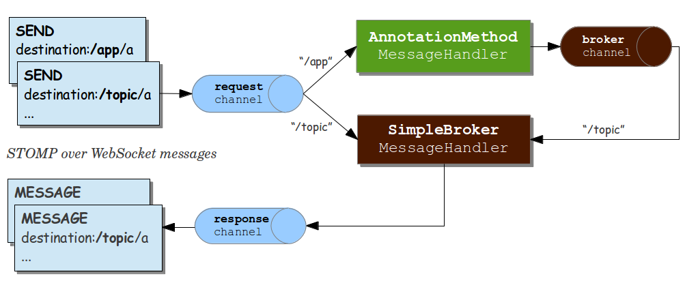
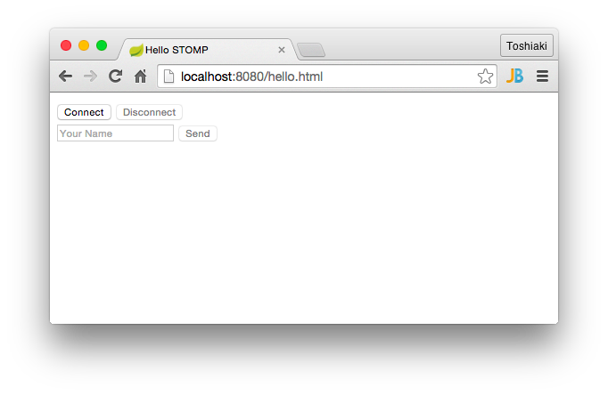
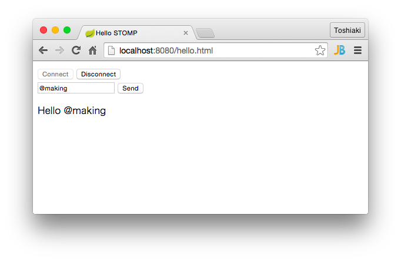

STOMPを使ってみる
********************************************************************************

前章でMessageListenerで非同期に画像処理を行いましたが、処理結果がクライアントには返ってきていません。
今度は処理結果もメッセージングで送るようにしましょう。ここではメッセージングプロトコルとして\ `STOMP <http://stomp.github.io/>`_\ を使用します。

STOMPは「Simple (or Streaming) Text Orientated Messaging Protocol」の略で、軽量なメッセージングプロトコルです。
TCPやWebSocket上で利用できます。

本章ではSTOMP over WebSocketの簡単な使い方を学びましょう。

まずはpom.xmlに以下の依存関係を追加してください。

.. code-block:: xml

    <!-- WebSocketプログラミングに必要な諸々 -->
    <dependency>
        <groupId>org.springframework.boot</groupId>
        <artifactId>spring-boot-starter-websocket</artifactId>
    </dependency>

\ ``App``\ クラスに以下を追加します。

.. code-block:: java
    :emphasize-lines: 6-21,24-29

    @SpringBootApplication
    @RestController
    public class App {
        // ...

        @Configuration
        @EnableWebSocketMessageBroker // WebSocketに関する設定クラス
        static class StompConfig extends AbstractWebSocketMessageBrokerConfigurer {

            @Override
            public void registerStompEndpoints(StompEndpointRegistry registry) {
                registry.addEndpoint("endpoint"); // WebSocketのエンドポイント
            }

            @Override
            public void configureMessageBroker(MessageBrokerRegistry registry) {
                registry.setApplicationDestinationPrefixes("/app"); // Controllerに処理させる宛先のPrefix
                registry.enableSimpleBroker("/topic"); // queueまたはtopicを有効にする(両方可)。queueは1対1(P2P)、topicは1対多(Pub-Sub)
            }
        }

        // ...

        @MessageMapping(value = "/greet" /* 宛先名 */) // Controller内の@MessageMappingアノテーションをつけたメソッドが、メッセージを受け付ける
        @SendTo(value = "/topic/greetings") // 処理結果の送り先
        String greet(String name) {
            log.info("received {}", name);
            return "Hello " + name;
        }

        // ※ handleHelloMessageは削除(またはコメントアウト)しておいてください。
        // ...
    }

ソースだけでは分かりにくいと思いますが、メッセージのフローは\ `下図 <http://rstoyanchev.github.io/webinar-websocket-spring/#26>`_\ のようになります。

宛先が/topicや/queueで始まるものはメッセージブローカー(仲介役)が直接ハンドリングします。
宛先が/appから始まるものはControllerに渡って処理され、その処理結果がメッセージブローカーに渡ります。

メッセージブローカーによって制御されたメッセージは、その宛先を購読しているクライアントへと送られます。

次に\ `Stomp.js <http://jmesnil.net/stomp-websocket/doc/>`_\ を使ってクライアントを作りましょう。\ :file:`src/main/resources/static`\ に\ :file:`hello.html`\ を作成してください。

.. note::

    Spring Bootでは\ :file:`src/main/resources/static`\ 以下が静的リソース置き場になります。このディレクトリにファイルを置くと、コンテキストパスから相対的にアクセスできます。

.. code-block:: html

    <!DOCTYPE html>
    <html>
    <head>
        <meta charset="UTF-8">
        <title>Hello STOMP</title>
    </head>
    <body>
    

        <button id="connect">Connect</button>
        <button id="disconnect" disabled="disabled">Disconnect</button>
    

    

        <input type="text" id="name" placeholder="Your Name">
        <button id="send" disabled="disabled">Send</button>
        

    

    </body>
    
    
    </html>

Stomp.jsを\ :file:`src/main/resources/static`\ にダウンロードしましょう。

.. code-block:: console

    $ cd src/main/resources/static
    $ wget https://raw.github.com/jmesnil/stomp-websocket/master/lib/stomp.js

\ ``App``\ クラスを起動し、http://localhost:8080/hello.html\ にアクセスしてください。

「Connect」ボタンを押して、フォームに名前を入力し、「Send」ボタンを押してください。

結果が返ってきました。今回は宛先をTopicにしているため、他のタブで別途Connectすれば全てのタブに結果が表示されます。

.. note::

    \ ``mvn spring-boot:run``\ で\ ``App``\ クラスを起動すれば、静的リソースの変更が即反映されるので開発中は便利です。

STOMPの簡単な使い方を学びました。以上で本章は終了です。

本章の内容を修了したらハッシュタグ「#kanjava_sbc #sbc06」をつけてツイートしてください。

次章ではJMSのMessageListenerの処理結果をSTOMPの宛先に送り、クライアントで表示させましょう。