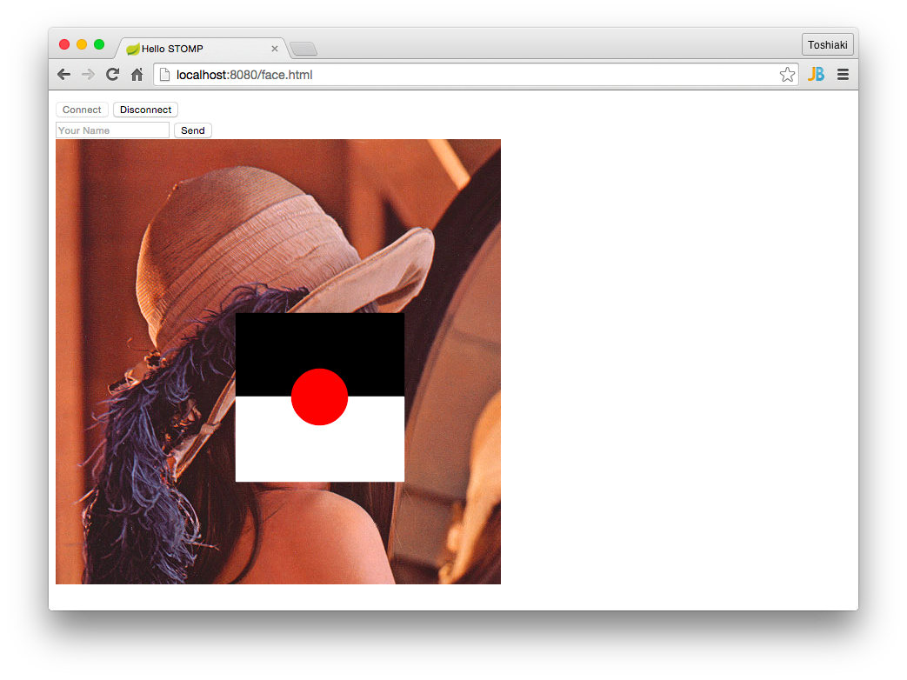
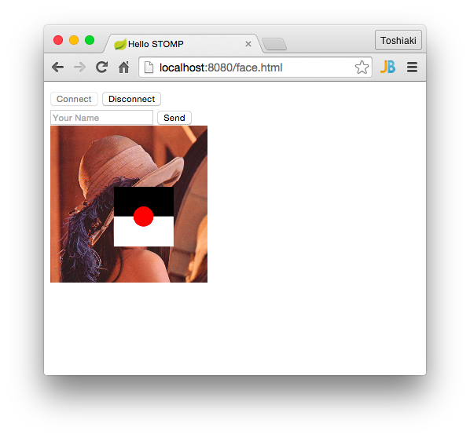

STOMP over WebSocketで非同期処理結果を受信する
********************************************************************************

本章ではJMSのMessageListenerの画像処理結果をSTOMPの宛先に送り、クライアントで表示させます。

STOMPの結果を送信するために\ ``SimpMessagingTemplate``\ を使用します。これまで使用した\ ``JmsMessagingTemplate``\ とほぼ同じインターフェースです。
画像はHTMLで表示しやすいように\ ``byte[]``\ に変換した後、Base64にエンコードして送信します(これも非効率)。

以下のコードを追加してください。

.. code-block:: java
    :emphasize-lines: 6-7,17-20,33-39

    @SpringBootApplication
    @RestController
    public class App {
        // ...

        @Autowired
        SimpMessagingTemplate simpMessagingTemplate;

        // ...

        @Configuration
        @EnableWebSocketMessageBroker
        static class StompConfig extends AbstractWebSocketMessageBrokerConfigurer {

            // ...

            @Override
            public void configureWebSocketTransport(WebSocketTransportRegistration registration) {
                registration.setMessageSizeLimit(10 * 1024 * 1024); // メッセージサイズの上限を10MBに上げる(デフォルトは64KB)
            }
        }

        // ...

        @JmsListener(destination = "faceConverter", concurrency = "1-5")
        void convertFace(Message<byte[]> message) throws IOException {
            log.info("received! {}", message);
            try (InputStream stream = new ByteArrayInputStream(message.getPayload())) {
                Mat source = Mat.createFrom(ImageIO.read(stream));
                faceDetector.detectFaces(source, FaceTranslator::duker);
                BufferedImage image = source.getBufferedImage();

                try (ByteArrayOutputStream baos = new ByteArrayOutputStream()) { // BufferedImageをbyte[]に変換
                    ImageIO.write(image, "png", baos);
                    baos.flush();
                    // 画像をBase64にエンコードしてメッセージ作成し、宛先'/topic/faces'へメッセージ送信
                    simpMessagingTemplate.convertAndSend("/topic/faces",
                            Base64.getEncoder().encodeToString(baos.toByteArray()));
                }
            }
        }
    }

HTMLも変更しましょう。宛先\ ``/topic/faces``\ への処理を追加するため、先ほどの\ :file:`hello.html`\ をコピーして\ :file:`face.html`\ を作成し、以下の修正を加えてください。

.. code-block:: html
    :emphasize-lines: 40,66-74,51-52

    <!DOCTYPE html>
    <html>
    <head>
        <meta charset="UTF-8">
        <title>Hello STOMP</title>
    </head>
    <body>
    

        <button id="connect">Connect</button>
        <button id="disconnect" disabled="disabled">Disconnect</button>
    

    

        <input type="text" id="name" placeholder="Your Name">
        <button id="send" disabled="disabled">Send</button>
        

    

    </body>
    
    
    </html>

\ ``App``\ クラスを再起動し、http://localhost:8080/face.html\ にアクセスし、「Connect」ボタンを押してください。
その後、\ :doc:`05-AsyncFaceConverter`\ で作成したサービスに変換したい画像を送信します。

.. code-block:: console

    $ curl -F 'file=@lena.png' localhost:8080/queue
    OK

送信した後、ブラウザを確認すると以下のように変換後の画像が表示されるはずです。

画像サイズが少し大きく、転送量が肥大化してしまうため、サーバーサイドでリサイズするようにしましょう。\ ``App``\ クラスを以下のように変更してください。

.. code-block:: java
    :emphasize-lines: 2,9-10,21-27

    // ...
    import static org.bytedeco.javacpp.opencv_imgproc.*;

    @SpringBootApplication
    @RestController
    public class App {
        // ...

        @Value("${faceduker.width:200}")
        int resizedWidth; // リサイズ後の幅

        // ...

        @JmsListener(destination = "faceConverter", concurrency = "1-5")
        void convertFace(Message<byte[]> message) throws IOException {
            log.info("received! {}", message);
            try (InputStream stream = new ByteArrayInputStream(message.getPayload())) {
                Mat source = Mat.createFrom(ImageIO.read(stream));
                faceDetector.detectFaces(source, FaceTranslator::duker);

                // リサイズ
                double ratio = ((double) resizedWidth) / source.cols();
                int height = (int) (ratio * source.rows());
                Mat out = new Mat(height, resizedWidth, source.type());
                resize(source, out, new Size(), ratio, ratio, INTER_LINEAR);

                BufferedImage image = out.getBufferedImage();

                try (ByteArrayOutputStream baos = new ByteArrayOutputStream()) {
                    ImageIO.write(image, "png", baos);
                    baos.flush();
                    // 画像をBase64にエンコードしてメッセージ作成し、宛先'/topic/faces'へメッセージ送信
                    simpMessagingTemplate.convertAndSend("/topic/faces",
                            Base64.getEncoder().encodeToString(baos.toByteArray()));
                }
            }
        }
    }

\ ``App``\ クラスを再起動して、クライアントを再接続してください。そして画像処理のリクエストを送り、ブラウザに以下のように表示されることを確認してください。

以上で本章は終了です。

本章の内容を修了したらハッシュタグ「#kanjava_sbc #sbc07」をつけてツイートしてください。

次はカメラをつかって顔画像を撮り、STOMPで撮った画像を送信し、その結果を今回同様に表示しましょう。次章ではまずはWebRTCによるカメラを使ってみましょう。