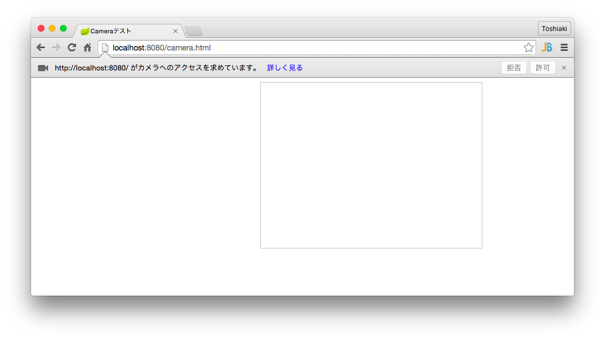
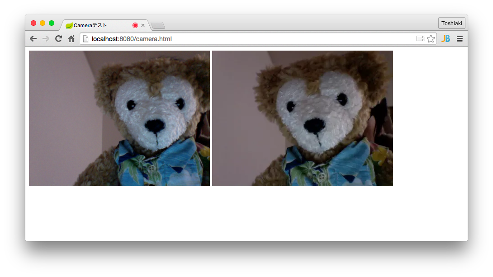

WebRTCを使ってみる
********************************************************************************

本章ではまずはWebRTCのgetUserMedia APIカメラにアクセスしてみましょう。

WebRTC(Web Real-Time Communication)ではリアルタイムコミュニケーション用のAPIが用意されていますが、本ハンズオンではgetUserMedia APIのみ使用します。

\ :file:`src/main/resources/static/camera.html`\ を作成して、以下の内容を記述してください。

.. code-block:: html

    <!doctype html>
    <html>
    <head>
        <title>Cameraテスト</title>
    </head>
    <body>
    <video autoplay width="400" height="300"></video>
    
    <canvas style="display:none;" width="400" height="300"></canvas>

    
    </body>
    </html>

http://localhost:8080/camera.html\ にアクセスしてください。

カメラアクセスへの許可を確認されますので、「許可」をクリックしてください。そうするとカメラの結果が左側に表示されます。

左のカメラ画像をクリックすると、右側にスナップショットして表示されます。

以上で本章は終了です。

本章の内容を修了したらハッシュタグ「#kanjava_sbc #sbc08」をつけてツイートしてください。

次章ではいよいよカメラ画像をサーバーに送信し、撮った画像が変換されて表示するようにします。