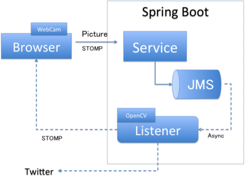

Spring Bootキャンプ ハンズオン資料
********************************************************************************

前提条件
================================================================================

* Java SE 8がインストールされていること。
* Mavenがインストールされていることかつ基本的なことが分かること。
* Gitがインストールされていること。
* OSがWindowsまたはMacOSであること。
* DIの基本的な知識を有していること。
* JavaでWebプログラミングの経験があること。
* (カメラを使う場合)PCにカメラがついていること。
* (Dockerを使う場合)boot2dockerがインストールされていること、またはAWSのアカウントを持っていること。

作るシステム
================================================================================

下図のような顔変換サービスを作ります。

目次
================================================================================

.. toctree::
   :maxdepth: 2
   :numbered:

   00-Prerequisite
   01-HelloWorld
   02-OpenCV
   03-FaceConverterService
   04-JMS
   05-AsyncFaceConverter
   06-STOMP
   07-STOMPOverWebSocket
   08-WebRTC
   09-WebRTCFaceConverter
   10-Docker
   11-DockerFaceConverter

